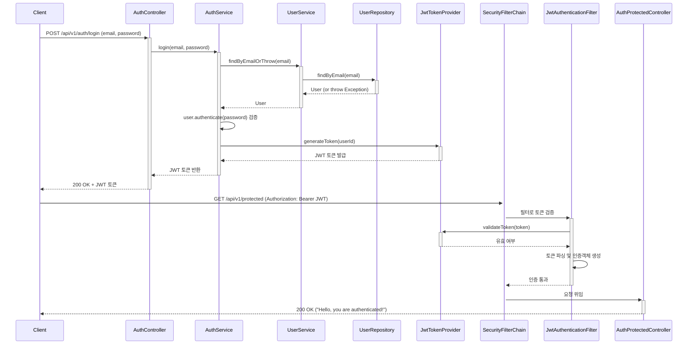
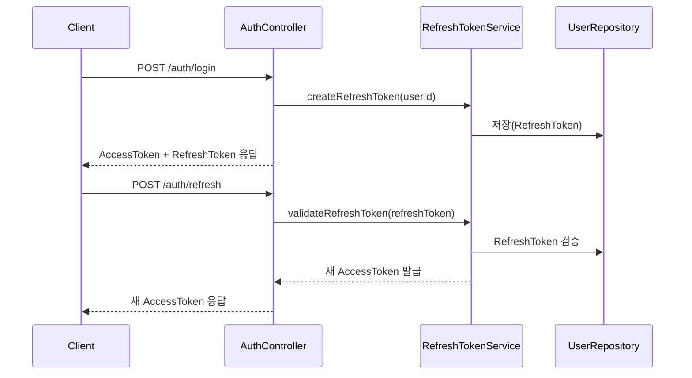

## ✅ 멀티모듈 설계 개요
```
AITravel/
├── build.gradle.kts (root)
├── settings.gradle.kts
├── common/               (공통 유틸/DTO/exception) 유틸, 공통 예외, DTO, Response Wrapper 등
├── domain-user/          (회원 도메인) 
├── domain-museum/        (박물관 도메인)
├── domain-translation/   (번역 도메인)
├── api-webflux/          (외부에 노출되는 WebFlux API)
├── batch-task/           (필요시 배치 처리)
└── external-ai-client/   (Python AI 서버 호출 클라이언트)
```

### 🔹 [3] common 모듈
유틸, 공통 예외, DTO, Response Wrapper 등

### 🔹 [4] domain-* 모듈
각 도메인별로 Entity, Repository, Service 등을 나눔
예: domain-user, domain-museum, domain-translation

### 🔹 [5] api-webflux 모듈
Controller와 외부 API 레이어만 존재


### 🔹 [6] external-ai-client 모듈
Python 서버로 OCR/번역 요청을 보내는 클라이언트

📌 보너스: 확장 고려
- module-api-admin (관리자 전용 API 분리)
- module-integration-kafka (Kafka 이벤트 연동용 모듈)
- module-core-llm (향후 LLM Prompt/Tuning 공통화)

## ✅ 개발 요구사항

### 📦 프로젝트 구조 및 아키텍처

- `멀티모듈 구조`로 확장성 있게 구성 (예: `api-webflux`, `domain-user`, `common`)
- `Netty`와 `Java 21` 기반으로 동작
- `Spring WebFlux` + `Spring Security` 사용
- 회원가입은 향후 `Google, Kakao 등 OAuth JWT 기반 인증`으로 확장할 수 있도록 설계
- `PreferredLanguage`, `Email`, `Password` 등은 모두 `Value Object`로 처리
- 공통 필드인 `createdAt`, `updatedAt`은 `BaseTimeEntity`로 공통 처리
- 패키지 네이밍은 `com.aitravel`로 통일

---

### 🔐 인증 / 회원 기능

- `회원가입`, `로그인` API 구현
- 로그인 성공 시 `JWT 토큰을 반환`해야 하며, 현재는 Stub (`dummy-jwt-token`)
- `UserService`는 `User.aggregate`를 기준으로 구현
- `UserRepository.findByEmail()`은 `Optional` 반환 → `findByEmailOrThrow` 방식으로 분기 처리

---

### ✅ 테스트 관련 요구사항

- 테스트는 반드시 **성공/실패 케이스 모두 작성**
- `@Nested` 구조로 테스트 그룹핑하여 가독성 확보
- `Mockito`, `AssertJ` 사용
- 필요한 경우 테스트용 `TestApplication`을 별도로 구성하되, `@SpringBootApplication` 대신 `@SpringBootConfiguration` 사용
- 테스트용 DB는 `H2` 사용, domain-user에 설정

---

### ⚙️ 개발 흐름 관리 요구

- **기능 단위로 커밋을 나눌 것**
- 커밋 시 너에게 `"커밋완료"` 라고 직접 알려줄 것
- 나는 **커밋을 하지 않을 수도 있으므로**, 너는 **파일 변경 상황이나 메시지를 통해 커밋 여부를 판단해줘야 함**
- 커밋 메시지를 **내가 하지 않았을 경우 너가 적절하게 추천해줘야 함**

---

### 🛠️ 요청 도구 / 템플릿

- `Notion 템플릿`, `작업보드`, `주간 체크리스트`, `기획서`, `유저 여정맵`, `비즈니스 모델 캔버스`, `도메인 모델`, `이벤트 스토밍`, `개발 순서 가이드` 등 다 요청하셨고 제공 완료

---

### 💡 향후 계획에 대한 메타 요구사항

- 이 프로젝트는 **AI 박물관 번역 기능을 시작으로 추후 'AI 여행 가이드 앱'의 일부로 통합될 예정**
- 따라서 **지금의 아키텍처가 후속 확장을 고려한 구조**여야 함 (이 점은 매우 중요)

---

좋습니다!

이제까지 우리 함께 만든 **개발/수정 목록**을 전체적으로 정리해줄게요.

(조금 길지만 전체 맥락이 한눈에 들어올 거야.)

---

# ✅ 지금까지 개발/수정한 목록 정리

## 📦 1. 프로젝트 및 모듈 구조

- **멀티모듈 구성**
    - `api-webflux` (Web API 서버, Netty 기반)
    - `domain-user` (User 도메인)
    - `common` (BaseTimeEntity 등 공통 도메인)
- **공통 설정**
    - 기본 패키지: `com.aitravel`
    - Java 21 + Spring Boot 3.2 + WebFlux + Security 사용
    - H2로 테스트용 DB 구성

---

## 🏗️ 2. 핵심 도메인 개발

- **User Entity 설계**
    - `User`는 `Email`, `Password`, `PreferredLanguage`를 VO(Value Object)로 소유
    - `User.register()` 정적 팩토리 메서드 작성
    - `User.authenticate()`, `changeLanguage()` 행위 메서드 추가
    - `@Embedded`를 통해 VO 주입
    - `createdAt`, `updatedAt` 필드는 `BaseTimeEntity` 상속해서 자동관리
- **BaseTimeEntity 작성**
    - `@CreatedDate`, `@LastModifiedDate` JPA Auditing 적용
    - 다른 엔티티들이 상속해서 공통으로 사용하도록 설계
- **UserRepository 작성**
    - `findByEmail(Email)` 메서드 제공
    - `Optional<User>` 반환
    - `findByEmailOrThrow(email)` 도메인 서비스에서 추가 (Exception throw)

---

## 🌐 3. API 기능 개발

- **회원가입 API 준비 (추후 확장 가능성 고려)**
- **로그인 API 개발**
    - `/api/v1/auth/login`
    - 요청 DTO (`LoginRequest`)
    - 응답 DTO (`LoginResponse`)
    - `AuthService`로 인증 로직 분리
- **로그인 흐름**
    - 이메일로 User 조회
    - 비밀번호 검증
    - 성공하면 토큰 발급

---

## 🔐 4. JWT 기능 도입

- **JWT 라이브러리 추가** (`jjwt-api`, `jjwt-impl`, `jjwt-jackson`)
- **application.yml**에 `jwt.secret`, `jwt.expiration` 설정
- **JwtProperties 클래스 작성** (설정 매핑)
- **JwtTokenProvider 작성**
    - JWT 생성 (userId를 subject로 설정)
    - 키 Base64 인코딩 및 만료시간 설정
- **AuthService 수정**
    - 로그인 성공 시 진짜 JWT 토큰 발급

---

## 🧪 5. 테스트 코드 개발

- **AuthServiceTest 작성**
    - `@Nested`를 사용해 성공/실패 케이스를 논리적으로 그룹핑
    - `UserService`, `AuthService` mock 기반 단위 테스트
    - 성공 케이스: 로그인 성공 후 토큰 반환
    - 실패 케이스 1: 존재하지 않는 이메일
    - 실패 케이스 2: 비밀번호 불일치
- **UserServiceTest 기본 작성**

---

## 🛠️ 6. 빌드/설정 수정

- Gradle 의존성 정비
    - `spring-boot-starter-test`, `mockito-core`, `assertj-core`, `spring-boot-starter-data-jpa`, `H2`
- `useJUnitPlatform()` 설정 추가
- 모듈별로 필요한 의존성만 최소화
- @SpringBootConfiguration을 이용해 테스트 전용 ApplicationContext 분리




✅ Refresh Token


